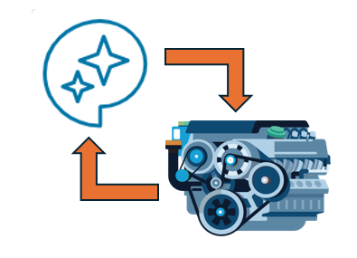
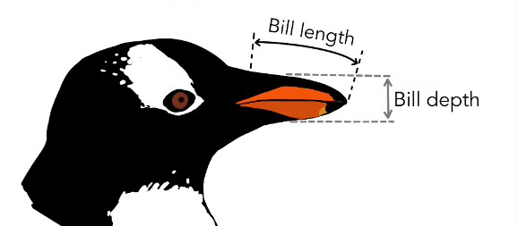
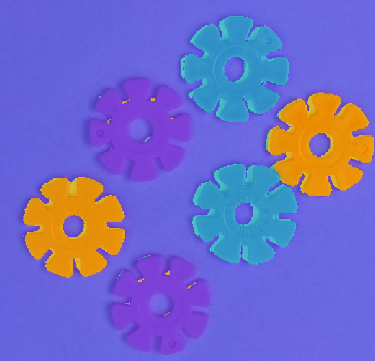

# Learning Engineering with GenAI

 or 

**Curriculum Module**

_Created with R2026a. Compatible with R2026a and later releases._

# Information

This curriculum module contains interactive [MATLAB® live scripts](https://www.mathworks.com/products/matlab/live-editor.html) and [Simulink®](https://www.mathworks.com/products/simulink.html) models that provide exposure to using generative AI within the MATLAB environment.

## Background

Learning Engineering with GenAI courseware will feature three interactive scripts. The first script will focus on an introduction to GenAI and large language models (LLMs) in MATLAB. The next script introduces the local GenAI tool in MATLAB (Copilot) and how to make the best use of it. The last script focuses on using Copilot to solve engineering problems.

The instructions inside the live scripts will guide you through the exercises and activities. Get started with each live script by running it one section at a time. To stop running the script or a section midway (for example, when an animation is in progress), use the  Stop button in the **RUN** section of the **Live Editor** tab in the MATLAB Toolstrip.

## Contact Us

Contact the [MathWorks Educator Content Development Team](mailto:onlineteaching@mathworks.com) if you would like to provide feedback, or if you have a question.

## Prerequisites

This module assumes some general genAI knowledge and basic MATLAB skills. There is some MATLAB knowledge required for these scripts and models, and you could use [MATLAB Onramp](https://matlabacademy.mathworks.com/details/matlab-onramp/gettingstarted), [Simulink Onramp](https://matlabacademy.mathworks.com/details/simulink-onramp/simulink), and [Simscape Onramp](https://matlabacademy.mathworks.com/details/simscape-onramp/simscape) as resources to acquire familiarity with MATLAB syntax, live scripts, and Simulink/Simscape models.

## Getting Started

### Accessing the Module

### **On MATLAB Online:**

Use the  link to download the module. You will be prompted to log in or create a MathWorks account. The project will be loaded, and you will see an app with several navigation options to get you started.

### **On Desktop:**

Download or clone this repository. Open MATLAB, navigate to the folder containing these scripts and double\-click on [LearnGenAI.prj](https://github.com/MathWorks-Teaching-Resources/Learning-Engineering-with-GenAI/blob/release/LearnGenAI.prj). It will add the appropriate files to your MATLAB path and open an app that asks you where you would like to start. 

Ensure you have all the required products ([listed below](#H_E850B4FF)) installed. If you need to include a product, add it using the Add\-On Explorer. To install an add\-on, go to the **Home** tab and select   **Add-Ons** > **Get Add-Ons**. 

## Products

 *MATLAB* is used throughout this module. Tools from  *Simulink, Simscape, Simscape Fluids, Symbolic Toolbox, MATLAB Copilot, and Simulink Copilot* are used as well. If your module uses a product not on this list, you can find it [*here*](https://www.mathworks.com/products.html)*.*

# Scripts

## [**GenAIFundamentals.mlx**](./Scripts/GenAIFundamentals.mlx)
||||
| :-: | :-- | :-- |
|    Created with Adobe Firefly    | **In this script, students will...**   $\bullet$ Acquire knowledge of GenAI terminology and classifications   $\bullet$ Identify capabilities and limitations of current GenAI    $\bullet$ Explore ways to access and interact with LLMs and tools in MATLAB   $\bullet$ Implement a local LLM with a tool in MATLAB and analyze its output    | **Academic disciplines**   $\bullet$ All Engineering Disciplines   $\bullet$ Artificial Intelligence      |

## [**IntroToCopilot.mlx**](./Scripts/IntroToCopilot.mlx)
||||
| :-: | :-- | :-- |
|     | **In this script, students will...**   $\bullet$ Learn the primary features of MATLAB and Simulink Copilot    $\bullet$ Generate code with MATLAB Copilot to solve an engineering problem   $\bullet$ Investigate and analyze a physical model using Simulink Copilot    | **Academic disciplines**   $\bullet$ All Engineering Disciplines   $\bullet$ Artificial Intelligence      |

## [**CopilotForLearners.mlx**](./Scripts/CopilotForLearners.mlx)
||||
| :-: | :-- | :-- |
|     | **In this script, students will...**   $\bullet$ Integrate Copilot into learning workflows   $\bullet$ Observe the results of various prompts   $\bullet$ Explore a manufacturing problem using Copilot   $\bullet$ Explore an electrical problem using Copilot   $\bullet$ Explore a signal processing problem using Copilot   $\bullet$ Explore a mechanical problem using Copilot    | **Academic disciplines**   $\bullet$ All Engineering Disciplines   $\bullet$ Artificial Intelligence      |

# License

The license for this module is available in the [LICENSE.md](https://github.com/MathWorks-Teaching-Resources/Learning-Engineering-with-GenAI/blob/release/LICENSE.md).

# Related Courseware Modules

## [**Machine Learning Methods: Clustering**](https://www.mathworks.com/matlabcentral/fileexchange/135381-machine-learning-methods-clustering)
|||
| :-: | :-- |
|     | **Available on:**           [GitHub](https://github.com/MathWorks-Teaching-Resources/Machine-Learning-Methods-Clustering)     |

## [Computer Vision Basics](https://www.mathworks.com/matlabcentral/fileexchange/180661-computer-vision-basics?s_tid=srchtitle)
|||
| :-- | :-- |
|     | **Available on:**           [GitHub](https://github.com/MathWorks-Teaching-Resources/Computer-Vision-Basics)      |

Or feel free to explore our other [modular courseware content](https://www.mathworks.com/matlabcentral/fileexchange/?q=tag%3A%22courseware+module%22&sort=downloads_desc_30d).

# Educator Resources
- [Educator Page](https://www.mathworks.com/academia/educators.html)

# Contribute 

Looking for more? Find an issue? Have a suggestion? Please contact the [MathWorks Educator Content Development Team](mailto:onlineteaching@mathworks.com). If you want to contribute directly to this project, you can find information about how to do so in the [CONTRIBUTING.md](https://github.com/MathWorks-Teaching-Resources/Learning-Engineering-with-GenAI/blob/release/CONTRIBUTING.md) page on GitHub.

© Copyright 2026 The MathWorks, Inc
